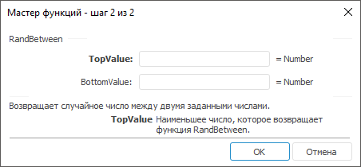

# RandBetween: Регламентный отчёт, настольное приложение

RandBetween: Регламентный отчёт, настольное приложение
-

# RandBetween

[Мастер функций](../../UiReport_Organizational_master_function.htm)
 для функции RandBetween выглядит
 следующим образом:

## Синтаксис

RandBetween(TopValue, BottomValue)

## Параметры

TopValue. Наименьшее число,
 которое возвращает функция RandBetween;

BottomValue. Наибольшее число,
 которое возвращает функция RandBetween.

Примечание.
 В качестве параметра можно указывать как непосредственно число, так и
 адрес ячейки, в которой оно располагается.

## Описание

Возвращает случайное число в интервале между двумя заданными числами.

## Комментарии

Новое случайное вещественное число возвращается при каждом вычислении
 листа.

## Пример

		 Формула
		 Результат
		 Описание

		 =RandBetween(3.3, 6)
		 Меняется.
		 Случайное число между 3,3 и 6.

		 =RandBetween(B6, C6)
		 Меняется.
		 Случайное число между числами в ячейках B6 и C6. Ячейка B6
		 содержит число -4, С6 содержит число 1.

См. также:

[Мастер функций](../../UiReport_Organizational_master_function.htm)
 │ [Математические
 функции](UiReport_Func_math.htm) │ [Rand](UiReport_Func_Math_Rand.htm)
 │ [IMath.RandBetween](MathLib.chm::/IMath/IMath.RandBetween.htm) │
 [IMath.RandBetweenI](MathLib.chm::/IMath/IMath.RandBetweenI.htm)

		Справочная
		 система на версию 10.9
		 от 18/08/2025,
		 © ООО «ФОРСАЙТ»,
