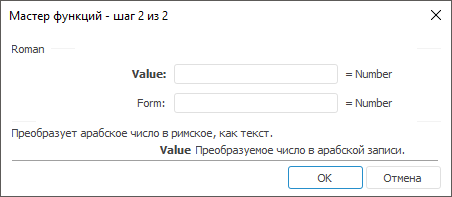

# Roman: Регламентный отчёт, настольное приложение

Roman: Регламентный отчёт, настольное приложение
-

# Roman

[Мастер функций](../../UiReport_Organizational_master_function.htm)
 для функции Roman выглядит следующим
 образом:

## Синтаксис

Roman(Value, Form)

## Параметры

Value. Преобразуемое число
 в арабской записи;

Form. Внутренний служебный
 параметр. Значение данного параметра не влияет на конечный результат и
 должно быть больше или равно 0 и меньше или равно 4.

Примечание.
 В качестве параметра можно указывать как непосредственно число, так и
 адрес ячейки, в которой оно располагается.

## Описание

Возвращает результат преобразования арабского числа в римское в виде
 текста.

## Пример

		 Формула
		 Результат
		 Описание

		 =Roman(2008, 0)
		 MMVIII
		 Форма записи римскими цифрами числа 2008.

		 =Roman(B6, 0)
		 XXI
		 Форма записи римскими цифрами числа, расположенного в ячейке
		 B6. Ячейка B6 содержит число 21.

См. также:

[Мастер функций](../../UiReport_Organizational_master_function.htm)
 │ [Математические
 функции](UiReport_Func_math.htm) │ [IMath.Roman](MathLib.chm::/Interface/IMath/IMath.Roman.htm)

		Справочная
		 система на версию 10.9
		 от 18/08/2025,
		 © ООО «ФОРСАЙТ»,
