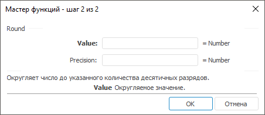

# Round: Регламентный отчёт, настольное приложение

Round: Регламентный отчёт, настольное приложение
-

# Round

[Мастер функций](../../UiReport_Organizational_master_function.htm)
 для функции Round выглядит следующим
 образом:

## Синтаксис

Round(Value, Precision)

## Параметры

Value. Округляемое число;

Precision. Количество десятичных
 разрядов, до которого требуется округлить число:

		- если Precision
		 больше 0, то число округляется до указанного количества десятичных
		 разрядов справа от запятой;

		- если Precision
		 равно 0, то число округляется до ближайшего целого;

		- если Precision
		 меньше 0, то число округляется слева от десятичной запятой.

Примечание.
 В качестве параметра можно указывать как непосредственно число, так и
 адрес ячейки, в которой оно располагается.

## Описание

Возвращает результат округления числа до указанного количества десятичных
 разрядов.

## Пример

		 Формула
		 Результат
		 Описание

		 =Round(124.658, 2)
		 124,66
		 Округляет число 124,658 до двух десятичных разрядов справа
		 от запятой.

		 =Round(B6, 0)
		 125
		 Округляет число в ячейке B6 до ближайшего целого. Ячейка B6
		 содержит число 124,658.

		 =Round(B6, C6)
		 100
		 Округляет число в ячейке B6 до количества разрядов, указанных
		 в ячейке C6. Ячейка B6 содержит число 124,658, C6 содержит число
		 -2.

См. также:

[Мастер функций](../../UiReport_Organizational_master_function.htm)
 │ [Математические
 функции](UiReport_Func_math.htm) │ [Ceiling](UiReport_Func_Math_Ceiling.htm)
 │ [Even](UiReport_Func_Math_Even.htm)
 │ [Floor](UiReport_Func_Math_Floor.htm)
 │ [Int](UiReport_Func_Math_Int.htm)
 │ [MRound](UiReport_Func_Math_MRound.htm)
 │ [Odd](UiReport_Func_Math_Odd.htm)
 │ [RoundDown](UiReport_Func_Math_RoundDown.htm)
 │ [RoundUp](UiReport_Func_Math_RoundUp.htm)
 │ [Trunc](UiReport_Func_Math_Trunc.htm)
 │ [IMath.Round](MathLib.chm::/Interface/IMath/IMath.Round.htm)

		Справочная
		 система на версию 10.9
		 от 18/08/2025,
		 © ООО «ФОРСАЙТ»,
