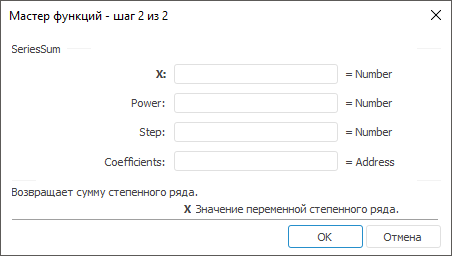

# SeriesSum: Регламентный отчёт, настольное приложение

SeriesSum: Регламентный отчёт, настольное приложение
-

# SeriesSum

[Мастер функций](../../UiReport_Organizational_master_function.htm)
 для функции SeriesSum выглядит
 следующим образом:

## Синтаксис

SeriesSum(X, Power, Step, Coefficients)

## Параметры

X. Значение переменной степенного
 ряда;

Power. Показатель степени X для первого члена степенного
 ряда;

Step. Шаг, на который увеличивается
 показатель степени Power для
 каждого следующего члена степенного ряда;

Coefficients. Диапазон ячеек,
 значения которых определяют набор коэффициентов при соответствующих степенях
 X. Количеством значений в параметре
 Coefficients определяется количество
 членов степенного ряда.

Примечание.
 В качестве параметра можно указывать как непосредственно число, так и
 адрес ячейки, в которой оно располагается.

## Описание

Возвращает сумму степенного ряда.

## Комментарии

Значение функции SeriesSum определяется
 по формуле:

,

где:

	- а1, а2, …, аi.
	 Набор коэффициентов. Соответствует параметру Coefficients;

	- n. Соответствует параметру
	 Power;

	- m. Соответствует параметру
	 Step.

## Пример

		 Формула
		 Результат
		 Описание

		 =SeriesSum(10, 1, 1, B6:D6)
		 5046,58
		 Сумма степенного ряда, члены которого заданы диапазоном ячеек
		 B6:D6. В данном диапазоне расположены следующие числа: 124,658;
		 -2; 4.

См. также:

[Мастер функций](../../UiReport_Organizational_master_function.htm)
 │ [Математические
 функции](UiReport_Func_math.htm) │ [IMath.SeriesSum](MathLib.chm::/Interface/IMath/IMath.SeriesSum.htm)

		Справочная
		 система на версию 10.9
		 от 18/08/2025,
		 © ООО «ФОРСАЙТ»,
