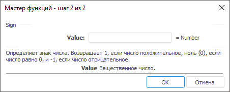

# Sign: Регламентный отчёт, настольное приложение

Sign: Регламентный отчёт, настольное приложение
-

# Sign

[Мастер функций](../../UiReport_Organizational_master_function.htm)
 для функции Sign выглядит следующим
 образом:

## Синтаксис

Sign(Value)

## Параметры

Value. Число, знак которого
 требуется определить.

Примечание.
 В качестве параметра можно указывать как непосредственно число, так и
 адрес ячейки, в которой оно располагается.

## Описание

Определяет знак числа.

## Комментарии

Может возвращать следующие значения:

	- 1 - если число положительное;

	- 0 - если число равно
	 0;

	- -1 - если число отрицательное.

## Пример

		 Формула
		 Результат
		 Описание

		 =Sign(-9)
		 -1
		 Знак отрицательного числа.

		 =Sign(B6)
		 1
		 Знак положительного числа в ячейке B6. Ячейка B6 содержит число
		 5,64.

См. также:

[Мастер функций](../../UiReport_Organizational_master_function.htm)
 │ [Математические
 функции](UiReport_Func_math.htm) │ [IMath.Sign](MathLib.chm::/Interface/IMath/IMath.Sign.htm)│ [IMath.SignI](MathLib.chm::/Interface/IMath/IMath.SignI.htm)

		Справочная
		 система на версию 10.9
		 от 18/08/2025,
		 © ООО «ФОРСАЙТ»,
