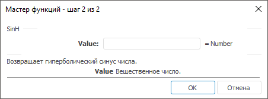

# SinH: Регламентный отчёт, настольное приложение

SinH: Регламентный отчёт, настольное приложение
-

# SinH

[Мастер функций](../../UiReport_Organizational_master_function.htm)
 для функции SinH выглядит следующим
 образом:

## Синтаксис

SinH(Value)

## Параметры

Value. Вещественное число,
 гиперболический синус которого требуется вычислить.

Примечание.
 В качестве параметра можно указывать как непосредственно число, так и
 адрес ячейки, в которой оно располагается.

## Описание

Возвращает гиперболический синус заданного числа.

## Пример

		 Формула
		 Результат
		 Описание

		 =SinH(-1.5)
		 -2,1293
		 Гиперболический синус числа -1,5.

		 =SinH(B6)
		 2,9422
		 Гиперболический синус числа, расположенного в ячейке B6. Ячейка
		 B6 содержит число 1,8.

См. также:

[Мастер функций](../../UiReport_Organizational_master_function.htm)
 │ [Математические
 функции](UiReport_Func_math.htm) │ [ASin](UiReport_Func_Math_ASin.htm)
 │ [ASinH](UiReport_Func_Math_ASinH.htm)
 │ [Sin](UiReport_Func_Math_Sin.htm)
 │ [IMath.SinH](MathLib.chm::/Interface/IMath/IMath.SinH.htm)

		Справочная
		 система на версию 10.9
		 от 18/08/2025,
		 © ООО «ФОРСАЙТ»,
