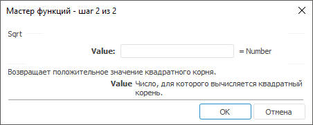

# Sqrt: Регламентный отчёт, настольное приложение

Sqrt: Регламентный отчёт, настольное приложение
-

# Sqrt

[Мастер функций](../../UiReport_Organizational_master_function.htm)
 для функции Sqrt выглядит следующим
 образом:

## Синтаксис

Sqrt(Value)

## Параметры

Value. Число большее или равное
 нулю, для которого требуется вычислить квадратный корень.

Примечание.
 В качестве параметра можно указывать как непосредственно число, так и
 адрес ячейки, в которой оно располагается.

## Описание

Возвращает положительное значение квадратного корня.

## Пример

		 Формула
		 Результат
		 Описание

		 =Sqrt(9)
		 3
		 Квадратный корень числа 9.

		 =Sqrt(B6)
		 5,01
		 Квадратный корень модуля числа в ячейке B6. Ячейка B6 содержит
		 число 25,1.

См. также:

[Мастер функций](../../UiReport_Organizational_master_function.htm)
 │ [Математические
 функции](UiReport_Func_math.htm) │ [SqrtPi](UiReport_Func_Math_SqrtPi.htm)
 │ [IMath.Sqrt](MathLib.chm::/Interface/IMath/IMath.Sqrt.htm)

		Справочная
		 система на версию 10.9
		 от 18/08/2025,
		 © ООО «ФОРСАЙТ»,
