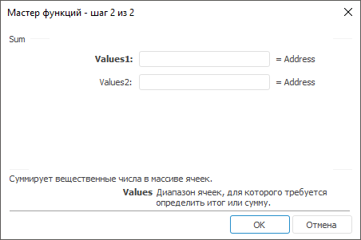

# Sum: Регламентный отчёт, настольное приложение

Sum: Регламентный отчёт, настольное приложение
-

# Sum

[Мастер функций](../../UiReport_Organizational_master_function.htm)
 для функции Sum выглядит следующим
 образом:

## Синтаксис

Sum(Values1, …)

## Параметры

Values1, Values2,
 …, ValuesN. Диапазон ячеек, для
 которого требуется определить итог или сумму.

## Описание

Возвращает сумму вещественных чисел в заданном интервале ячеек.

## Пример

		 Формула
		 Результат
		 Описание

		 =Sum(B6:E6)
		 17,2
		 Сумма значений в диапазоне ячеек от B6 до E6. В данном диапазоне
		 расположены следующие числа: 12,1; -2; 4; 3,1.

См. также:

[Мастер функций](../../UiReport_Organizational_master_function.htm)
 │ [Математические
 функции](UiReport_Func_math.htm) │ [SumSq](UiReport_Func_Math_SumSq.htm)
 │ [SumX2MY2](UiReport_Func_Math_SumX2MY2.htm)
 │ [SumX2PY2](UiReport_Func_Math_SumX2PY2.htm)
 │ [SumXMY2](UiReport_Func_Math_SumXMY2.htm)
 │ [IMath.Sum](MathLib.chm::/Interface/IMath/IMath.Sum.htm)│ [IMath.SumI](MathLib.chm::/Interface/IMath/IMath.SumI.htm)

		Справочная
		 система на версию 10.9
		 от 18/08/2025,
		 © ООО «ФОРСАЙТ»,
