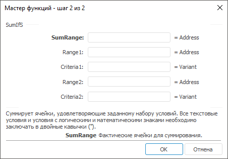

# SumIfS: Регламентный отчёт, настольное приложение

SumIfS: Регламентный отчёт, настольное приложение
-

# SumIfS

[Мастер функций](../../UiReport_Organizational_master_function.htm)
 для функции SumIfS выглядит следующим
 образом:

## Синтаксис

SumIfS(SumRange, Range1, Criteria1, Range2, Criteria2,
 …)

## Параметры

SumRange. Фактические ячейки
 для суммирования;

Range1, Range2,
 …, RangeN. Диапазон ячеек, проверяемых
 на соответствие определённому условию;

Важно.
 Каждый диапазон Range должен
 соответствовать по размеру и форме диапазону SumRange.

Criteria1, Criteria2,
 …, CriteriaN. Условие, определяющее
 суммируемые ячейки. Условие может быть в форме числа, выражения, ссылки
 на ячейку, текста или функции.

Примечание.
 Все текстовые условия и условия с логическими и математическими знаками
 необходимо заключать в двойные кавычки (“).

## Описание

Возвращает сумму чисел в заданном интервале ячеек, удовлетворяющие заданному
 набору условий.

## Пример

		 Формула
		 Результат
		 Описание

		 =SumIfS(A0:A3, B0:B3, "<0", C0:C3,
		 "<0")
		 4
		 Сумма значений массива, расположенного в ячейках A0, A1, A2,
		 A3 при условии, что значения в ячейках от B0 до B3 и от C0
		 до C3 должны быть отрицательны. В диапазоне от A0 до A3 расположены
		 следующие числа: -2, 6, 4, -8; в диапазоне от B0 до B3: -6,
		 4, -9, 5; в диапазоне от C0 до C3: 2, -8, -3, -7.

См. также:

[Мастер функций](../../UiReport_Organizational_master_function.htm) │
 [Математические
 функции](UiReport_Func_math.htm)

		Справочная
		 система на версию 10.9
		 от 18/08/2025,
		 © ООО «ФОРСАЙТ»,
