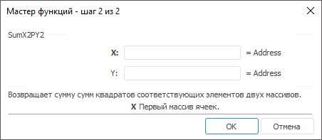

# SumX2PY2: Регламентный отчёт, настольное приложение

SumX2PY2: Регламентный отчёт, настольное приложение
-

# SumX2PY2

[Мастер функций](../../UiReport_Organizational_master_function.htm)
 для функции SumX2PY2 выглядит
 следующим образом:

## Синтаксис

SumX2PY2(X, Y)

## Параметры

X. Диапазон ячеек, в которых
 расположены числа первого массива;

Y. Диапазон ячеек, в которых
 расположены числа второго массива.

Примечание.
 Размерности первого и второго массива должны совпадать, иначе функция
 возвращает значение 0.

## Описание

Возвращает сумму сумм квадратов соответствующих значений в двух массивах.

## Пример

		 Формула
		 Результат
		 Описание

		 =SumX2PY2(B6:E6, B7:E7)
		 46,04
		 Сумма сумм квадратов соответствующих значений в диапазонах
		 ячеек от B6 до E6 и от B7 до E7. В диапазоне B6:E6 расположены
		 следующие числа: 3; 4; 3,6; -0,2; а в диапазоне B7:E7 расположены
		 следующие числа: 2; -1,4; 0,8; 1,2.

См. также:

[Мастер функций](../../UiReport_Organizational_master_function.htm)
 │ [Математические
 функции](UiReport_Func_math.htm) │ [Sum](UiReport_Func_Math_Sum.htm)
 │ [SumSq](UiReport_Func_Math_SumSq.htm)
 │ [SumX2MY2](UiReport_Func_Math_SumX2MY2.htm)
 │ [SumXMY2](UiReport_Func_Math_SumXMY2.htm)
 │ [IMath.SumX2PY2](MathLib.chm::/Interface/IMath/IMath.SumX2PY2.htm)

		Справочная
		 система на версию 10.9
		 от 18/08/2025,
		 © ООО «ФОРСАЙТ»,
