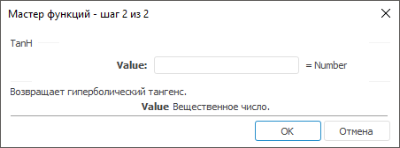

# TanH: Регламентный отчёт, настольное приложение

TanH: Регламентный отчёт, настольное приложение
-

# TanH

[Мастер функций](../../UiReport_Organizational_master_function.htm)
 для функции TanH выглядит следующим
 образом:

## Синтаксис

TanH(Value)

## Параметры

Value. Угол в радианах, гиперболический
 тангенс которого требуется вычислить.

Примечание.
 В качестве параметра можно указывать как непосредственно число, так и
 адрес ячейки, в которой оно располагается.

## Описание

Возвращает гиперболический тангенс заданного угла.

## Пример

		 Формула
		 Результат
		 Описание

		 =TanH(21.5)
		 1
		 Гиперболический тангенс угла 21,5 радиан.

		 =TanH(B6)
		 -0,0997
		 Гиперболический тангенс угла, значение которого расположено
		 в ячейке B6. Ячейка B6 содержит число -0,1.

Примечание.
 Если угол задан в градусах, используйте функцию [Radians](UiReport_Func_Math_Radians.htm),
 чтобы преобразовать его в радианы.

См. также:

[Мастер функций](../../UiReport_Organizational_master_function.htm)
 │ [Математические
 функции](UiReport_Func_math.htm) │ [ATan](UiReport_Func_Math_ATan.htm)
 │ [ATan2](UiReport_Func_Math_ATan2.htm)
 │ [ATanH](UiReport_Func_Math_ATanH.htm)
 │ [Tan](UiReport_Func_Math_Tan.htm)
 │ [IMath.TanH](MathLib.chm::/Interface/IMath/IMath.TanH.htm)

		Справочная
		 система на версию 10.9
		 от 18/08/2025,
		 © ООО «ФОРСАЙТ»,
