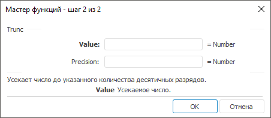

# Trunc: Регламентный отчёт, настольное приложение

Trunc: Регламентный отчёт, настольное приложение
-

# Trunc

[Мастер функций](../../UiReport_Organizational_master_function.htm)
 для функции Trunc выглядит следующим
 образом:

## Синтаксис

Trunc(Value[, Precision])

## Параметры

Value. Усекаемое число;

Precision. Количество десятичных
 разрядов, определяющее точность усечения. Положительные значения вызывают
 усечение дробной части, отрицательные - целой части, ноль - усечение до
 целого числа. Значение по умолчанию 0.

Примечание.
 В качестве параметра можно указывать как непосредственно число, так и
 адрес ячейки, в которой оно располагается.

## Описание

Усекает число до указанного количества десятичных разрядов.

## Пример

		 Формула
		 Результат
		 Описание

		 =Trunc(21.525,1)
		 21,5
		 Усекает дробную часть числа 21,525 с точностью одна десятая.

		 =Trunc(21.525,-1)
		 20
		 Усекает целую часть числа 21,525.

		 =Trunc(B6)
		 -4
		 Усекает число в ячейке B6 до целого. Ячейка B6 содержит число
		 -4,6.

См. также:

[Мастер функций](../../UiReport_Organizational_master_function.htm)
 │ [Математические
 функции](UiReport_Func_math.htm) │ [Ceiling](UiReport_Func_Math_Ceiling.htm)
 │ [Even](UiReport_Func_Math_Even.htm)
 │ [Floor](UiReport_Func_Math_Floor.htm)
 │ [Int](UiReport_Func_Math_Int.htm)
 │ [MRound](UiReport_Func_Math_MRound.htm)
 │ [Odd](UiReport_Func_Math_Odd.htm)
 │ [Round](UiReport_Func_Math_Round.htm)
 │ [RoundDown](UiReport_Func_Math_RoundDown.htm)
 │ [RoundUp](UiReport_Func_Math_RoundUp.htm)
 │ [IMath.Trunc](MathLib.chm::/Interface/IMath/IMath.Trunc.htm)

		Справочная
		 система на версию 10.9
		 от 18/08/2025,
		 © ООО «ФОРСАЙТ»,
