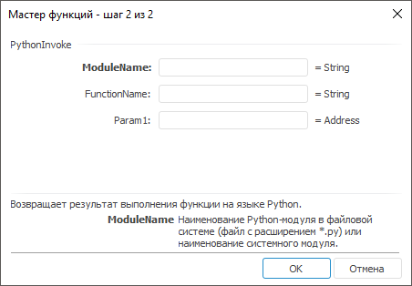

# PythonInvoke: Регламентный отчёт, настольное приложение

PythonInvoke: Регламентный отчёт, настольное приложение
-

# PythonInvoke

[Мастер функций](../../UiReport_Organizational_master_function.htm)
 для функции PythonInvoke:

## Синтаксис

PythonInvoke(ModuleName, FunctionName, Param,…)

## Параметры

ModuleName.
 Наименование Python-модуля в файловой системе или наименование системного
 модуля. При указании Python-модуля в файловой системе используется файл
 с расширением *.ру.

Поиск указанного модуля производится:

	- в папке установки Python рядом с файлом python3*.dll или во
	 вложенной папке Scripts;

	- по указанному пути, который задается с помощью строкового параметра
	 PythonPath в ветке реестра HKEY_CURRENT_USER\SOFTWARE\Foresight\Foresight Analytics Platform\10.0\DevEnv\Python. Для
	 получения подробной информации обратитесь к разделу «[Подключение
	 дополнительных модулей к «Форсайт. Аналитическая платформа](UiNav.chm::/02_Navigator/CommonSettings/Integration.htm#java)»;

	- в папке установки продукта «Форсайт. Аналитическая платформа».

FunctionName. Наименование
 выполняемой функции;

Param1, Param2, …, ParamN.
 Параметры, передаваемые в функцию.

Примечание.
 В качестве параметра можно указывать как непосредственно значение, так
 и адрес ячейки, в которой оно располагается.

## Описание

Возвращает результат выполнения функции на языке Python.

Примечание.
 Перед использованием функции убедитесь, что выполнена [интеграция](uinav.chm::/02_Navigator/CommonSettings/Integration.htm)
 «Форсайт. Аналитическая платформа»
 с Python.

## Комментарии

Функция может содержать несколько параметров. В мастере формул новые
 параметры добавляются автоматически после того, как пользователь установил
 курсор в поле с параметром. Если были добавлены лишние параметры, то их
 нужно оставить пустыми. Если функция не содержит параметры, то поле Param необходимо оставить пустым.

При вызове функций Python учитывайте следующие особенности:

	- наименование модуля и выполняемой функции регистрозависимые.
	 Наименование модуля указывается без расширения .py;

	- модуль, в котором расположена функция, должен быть скопирован
	 в папку установки «Форсайт. Аналитическая платформа»
	 или должен быть импортирован в состав библиотеки Python;

	- параметры функции и результат, который она возвращает, должны
	 иметь один из следующих типов данных: Null, Boolean, Integer, Double,
	 Decimal (применим только к результату, возвращаемому функцией), String;

	- если в модуле используются операции ввода и вывода, то используйте
	 для них механизм критических секций.

Совет. Для получения
 подробной информации о написании функций на языке Python и об импорте
 модулей в состав библиотеки Python обратитесь к [документации
 Python](https://docs.python.org/3/).

## Пример

В таблице приведены примеры формул с использованием функции PythonInvoke:

		 Формула
		 Результат
		 Описание

		 =PythonInvoke("math", "fabs",
		 4)
		 4
		 Модуль числа 4.

		 =PythonInvoke("math", "fabs",
		 C3)
		 4
		 Модуль числа, расположенного в ячейке C3. В ячейке C3 находится
		 число 4.

		 =PythonInvoke(C4, "fabs", C3)
		 9
		 Модуль числа, расположенного в ячейке C3. В ячейке C4 находится
		 текстовое значение math, в ячейке C3 - число -9.

В формулах используются параметры:

	- math. Системный модуль
	 языка Python, содержащий математические функции;

	- fabs. Системная функция языка
	 Python, содержащаяся в модуле «math», возвращающая абсолютную величину
	 числа.

См. также:

[Мастер функций](../../UiReport_Organizational_master_function.htm) │
 [Функции для работы с Python](Python.htm)

		Справочная
		 система на версию 10.9
		 от 18/08/2025,
		 © ООО «ФОРСАЙТ»,
