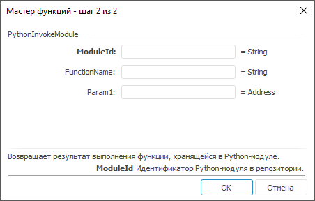

# PythonInvokeModule: Регламентный отчёт, настольное приложение

PythonInvokeModule: Регламентный отчёт, настольное приложение
-

# PythonInvokeModule

[Мастер функций](../../UiReport_Organizational_master_function.htm)
 для функции PythonInvokeModule:

## Синтаксис

PythonInvokeModule(ModuleId, FunctionName, Param,…)

## Параметры

ModuleId. Идентификатор Python-модуля в репозитории;

FunctionName. Наименование
 выполняемой функции;

Param1, Param2, …, ParamN.
 Параметры, передаваемые в функцию.

Примечание.
 В качестве параметра можно указывать как непосредственно значение, так
 и адрес ячейки, в которой оно располагается.

## Описание

Возвращает результат выполнения функции, хранящейся в [Python-модуле](UiDevEnv.chm::/01_Development_Environment/02_Work_in_Development_Environment/DevEnv_Object/python_module.htm).

Примечание.
 Перед использованием функции убедитесь, что выполнена [интеграция](uinav.chm::/02_Navigator/CommonSettings/Integration.htm)
 «Форсайт. Аналитическая платформа»
 с Python.

## Комментарии

Функция может содержать несколько параметров. В мастере формул новые
 параметры добавляются автоматически после того, как пользователь установил
 курсор в поле с параметром. Если были добавлены лишние параметры, то их
 нужно оставить пустыми. Если функция не содержит параметры, то поле Param необходимо оставить пустым.

При вызове функций Python учитывайте следующие особенности:

	- наименование выполняемой функции регистрозависимое;

	- параметры функции и результат, который она возвращает, должны
	 иметь один из следующих типов данных: Null, Boolean, Integer, Double,
	 Decimal (применим только к результату, возвращаемому функцией), String;

	- если в модуле используются операции ввода и вывода, то используйте
	 для них механизм критических секций.

Совет. Для получения
 подробной информации о написании функций на языке Python и об импорте
 модулей в состав библиотеки Python обратитесь к [документации
 Python](https://docs.python.org/3/).

## Пример

Рассмотрим код на Python, содержащийся в Python-модуле с идентификатором
 MOD_PYT:

def calculate(a, b)
    return b%a+a
def check(value)
    if (value>1000):
        return 1
    else
        return 0
В таблице приведены примеры формул с использованием функции PythonInvokeModule:

		 Формула
		 Результат
		 Описание

		 =PythonInvokeModule("MOD_PYT", "calculate",
		 4, 40)
		 4
		 Вызов функции «calculate» из Python-модуля в репозитории с
		 идентификатором MOD_PYT. В качестве значения параметров передаются
		 фиксированные значения.

		 =PythonInvokeModule("MOD_PYT", "check",
		 C3)
		 1 или 0
		 Вызов функции «check» из Python-модуля в репозитории с идентификатором
		 MOD_PYT. В качестве значения параметра передаётся значение ячейки
		 C3. Если значение ячейки больше 1000, то возвращается 1, иначе
		 - 0.

См. также:

[Мастер функций](../../UiReport_Organizational_master_function.htm) │
 [Функции для работы с Python](Python.htm)

		Справочная
		 система на версию 10.9
		 от 18/08/2025,
		 © ООО «ФОРСАЙТ»,
