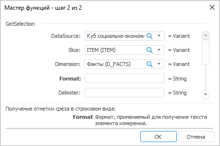

# GetSelection: Регламентный отчёт, настольное приложение

GetSelection: Регламентный отчёт, настольное приложение
-

# GetSelection

[Мастер функций](../../UiReport_Organizational_master_function.htm)
 для функции GetSelection выглядит
 следующим образом:

## Синтаксис

GetSelection(DataSource, Slice, Dimension[, Format[,
 Delimiter[, MergeRange])

## Параметры

DataSource. Номер или идентификатор
 источника данных;

Slice. Номер или наименование
 среза;

Dimension. Номер, наименование
 или идентификатор измерения в срезе;

Format. Формат, применяемый
 для получения текста элемента измерения. Параметр является необязательным.
 Значение по умолчанию отсутствует;

Delimiter. Разделитель, используемый
 для отделения наименований элементов друг от друга. Параметр является
 необязательным. Значение по умолчанию «,»;

MergeRange. Параметр является
 необязательным. Признак объединения элементов, идущих подряд, в диапазон:

	- True. Объединять элементы
	 в диапазон;

	- False. Не объединять
	 элементы в диапазон. Значение по умолчанию.

Примечание.
 В качестве параметра можно указывать как непосредственно значение параметра,
 так и адрес ячейки, в которой оно располагается.

## Описание

Возвращает отметку среза в строковом виде.

## Пример

Для построения области данных будет использоваться «Куб
 социально-экономических показателей», который используется в разделе
 «[Пример
 создания куба](UiNavObj.chm::/Cube/UiMd_Cube_Example.htm)».

Добавьте данный куб в область «Источники
 данных и срезы» панели «[Источники
 и срезы данных](../../../Source/UiReport_Source.htm)». Создайте для него срез, который будет использоваться
 для построения области данных. Измерения среза разместите следующим образом:

	- По столбцам. Календарь;

	- По строкам. Территориальные
	 измерения;

	- Фиксированные. Социально-экономические
	 показатели, Источники данных, Факты.

Произведите отметку в измерениях и разместите область данных.

Далее вычислите область данных. Для этого отметьте любую из ячеек данной
 области и выполните команду «Вычислить
 область данных» контекстного меню .

Область данных выглядит следующим образом:

		 Формула
		 Результат
		 Описание

		 =GetSelection("cube_sep", "Срез",
		 "Календарь","Name",E7)
		 2002-//-2003-//-2004
		 Получение отметки измерения «Календарь»
		 в строковом виде через разделитель, указанный в ячейке E7. Ячейка
		 E7 содержит значение «-//-». Для наименование элементов, входящих
		 в отметку, будет использоваться значение атрибута Name календарного
		 справочника.

		 =GetSelection("cube_sep", "Срез",
		 "Календарь","","",true)
		 2002-2004
		 Получение отметки измерения «Календарь»
		 в строковом виде. Элементы, идущие подряд, объединены в диапазон.

См. также:

[Мастер функций](../../UiReport_Organizational_master_function.htm)
 │ [Функции
 для работы с отчетом](UiReport_Func_Report.htm) │ [GetSelectionEl](UiReport_Func_Report_GetSelectionEl.htm)

		Справочная
		 система на версию 10.9
		 от 18/08/2025,
		 © ООО «ФОРСАЙТ»,
