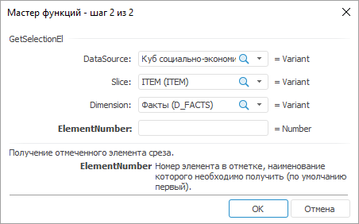
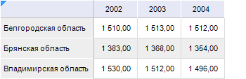

# GetSelectionEl: Регламентный отчёт, настольное приложение

GetSelectionEl: Регламентный отчёт, настольное приложение
-

# GetSelectionEl

[Мастер функций](../../UiReport_Organizational_master_function.htm)
 для функции GetSelectionEl выглядит
 следующим образом:

## Синтаксис

GetSelectionEl(DataSource, Slice, Dimension[, ElementNumber])

## Параметры

DataSource. Номер или идентификатор
 источника данных;

Slice. Номер или наименование
 среза;

Dimension. Номер, наименование
 или идентификатор измерения в срезе;

ElementNumber. Номер элемента
 в отметке, наименование которого необходимо получить. Нумерация элементов
 в отметке, начинается с нуля. Данный параметр не является обязательным.
 Значение по умолчанию 0.

Примечание.
 В качестве параметра можно указывать как непосредственно значение параметра,
 так и адрес ячейки, в которой оно располагается.

## Описание

Возвращает наименование отмеченного элемента среза.

## Пример

Для построения области данных будет использоваться «Куб
 социально-экономических показателей», который используется в разделе
 «[Пример
 создания куба](UiNavObj.chm::/Cube/UiMd_Cube_Example.htm)».

Добавьте данный куб в область «Источники
 данных и срезы» панели «[Источники
 и срезы данных](../../../Source/UiReport_Source.htm)». Создайте для него срез, который будет использоваться
 для построения области данных. Измерения среза разместите следующим образом:

	- По столбцам. Календарь;

	- По строкам. Территориальные
	 измерения;

	- Фиксированные. Социально-экономические
	 показатели, Источники данных, Факты.

Произведите отметку в измерениях и разместите область данных.

Далее вычислите область данных. Для этого отметьте любую из ячеек данной
 области и выполните команду «Вычислить
 область данных» контекстного меню.

Область данных выглядит следующим образом:

		 Формула
		 Результат
		 Описание

		 =GetSelectionEl("cube_sep", "Срез",
		 "Территориальные образования")
		 Белгородская область
		 Получение первого отмеченного элемента измерения «Территориальные
		 образования» в указанном срезе выбранного куба.

		 =GetSelectionEl("cube_sep", "Срез",
		 "Территориальные образования",E7)
		 Владимирская область
		 Получение элемента измерения «Территориальные
		 образования» в указанном срезе выбранного куба. Номер элемента
		 задан в ячейке E7. Ячейка E7 содержит значение 2.

См. также:

[Мастер функций](../../UiReport_Organizational_master_function.htm)
 │ [Функции
 для работы с отчетом](UiReport_Func_Report.htm) │ [GetSelection](UiReport_Func_Report_GetSelection.htm)

		Справочная
		 система на версию 10.9
		 от 18/08/2025,
		 © ООО «ФОРСАЙТ»,
