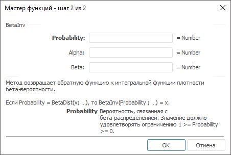

# BetaInv: Регламентный отчёт, настольное приложение

BetaInv: Регламентный отчёт, настольное приложение
-

# BetaInv

[Мастер функций](../../UiReport_Organizational_master_function.htm)
 для функции BetaInv выглядит следующим
 образом:

## Синтаксис

BetaInv(Probability, Alpha, Beta)

## Параметры

Probability. Вероятность, связанная
 с бета-распределением. Значение должно удовлетворять ограничению: 1 >=
 Probability >= 0;

Alpha. Параметр распределения.
 Значение должно удовлетворять ограничению Alpha
 > 0;

Beta. Параметр распределения.
 Значение должно удовлетворять ограничению Beta
 > 0.

## Описание

Метод возвращает обратную функцию к интегральной функции плотности бета-вероятности.

## Комментарии

Если Probability = [BetaDist](UiReport_Func_Statistic_BetaDist.htm)(x; …), то BetaInv(Probability; …) = x.

См. также:

[Мастер функций](../../UiReport_Organizational_master_function.htm)
 | [Статистические функции](UiReport_Func_Statistic.htm)

		Справочная
		 система на версию 10.9
		 от 18/08/2025,
		 © ООО «ФОРСАЙТ»,
