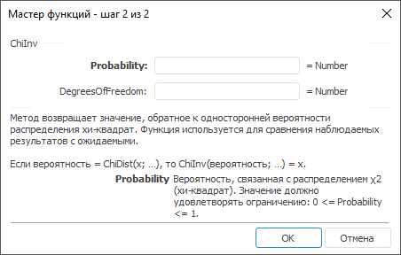

# ChiInv: Регламентный отчёт, настольное приложение

ChiInv: Регламентный отчёт, настольное приложение
-

# ChiInv

[Мастер функций](../../UiReport_Organizational_master_function.htm)
 для функции ChiInv выглядит следующим
 образом:

## Синтаксис

ChiInv(Probability, DegreesOfFreedom)

## Параметры

Probability. Вероятность, связанная
 с распределением χ2
 (хи-квадрат). Значение должно удовлетворять ограничению: 0 <= Probability <= 1;

DegreesOfFreedom. Число степеней
 свободы. Допустимые значения берутся из диапазона (1, 10^10).

## Описание

Метод возвращает значение, обратное к односторонней вероятности распределения
 хи-квадрат.

## Комментарии

Функция используется для сравнения наблюдаемых результатов с ожидаемыми.

Если вероятность = [ChiDist](UiReport_Func_Statistic_ChiDist.htm)(x;
 …), то ChiInv(вероятность;
 …) = x.

См. также:

[Мастер функций](../../UiReport_Organizational_master_function.htm)
 | [Статистические функции](UiReport_Func_Statistic.htm)

		Справочная
		 система на версию 10.9
		 от 18/08/2025,
		 © ООО «ФОРСАЙТ»,
