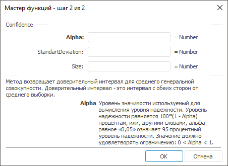

# Confidence: Регламентный отчёт, настольное приложение

Confidence: Регламентный отчёт, настольное приложение
-

# Confidence

[Мастер функций](../../UiReport_Organizational_master_function.htm)
 для функции Confidence выглядит
 следующим образом:

## Синтаксис

Confidence(Alpha, StandartDeviation, Size)

## Параметры

Alpha. Уровень значимости,
 используемый для вычисления уровня надежности. Значение должно удовлетворять
 ограничению: 0 < Alpha <
 1;

StandartDeviation. Стандартное
 отклонение генеральной совокупности для интервала данных, предполагается
 известным. Значение должно удовлетворять ограничению: StandartDeviation
 > 0;

Size. Размер выборки.

## Описание

Метод возвращает доверительный интервал для среднего генеральной совокупности.

## Комментарии

Доверительный интервал - это интервал с обеих сторон от среднего выборки.

Уровень надежности равняется 100*(1 - Alpha)
 процентам, или, другими словами, альфа равное «0,05» означает 95 процентный
 уровень надежности.

См. также:

[Мастер функций](../../UiReport_Organizational_master_function.htm)
 | [Статистические функции](UiReport_Func_Statistic.htm)

		Справочная
		 система на версию 10.9
		 от 18/08/2025,
		 © ООО «ФОРСАЙТ»,
