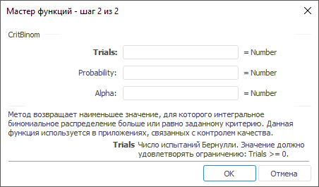

# CritBinom: Регламентный отчёт, настольное приложение

CritBinom: Регламентный отчёт, настольное приложение
-

# CritBinom

[Мастер функций](../../UiReport_Organizational_master_function.htm)
 для функции CritBinom выглядит
 следующим образом:

## Синтаксис

CritBinom(Trials, Probability, Alpha)

## Параметры

Trials. Число испытаний Бернулли.
 Значение должно удовлетворять ограничению: Trials
 >= 0;

Probability. Вероятность успеха
 в каждом испытании. Допустимые значения берутся из диапазона [0, 1];

Alpha. Значение критерия. Допустимые
 значения берутся из диапазона [0, 1].

## Описание

Метод возвращает наименьшее значение, для которого интегральное биномиальное
 распределение больше или равно заданному критерию.

## Комментарии

Данная функция используется в приложениях, связанных с контролем качества.

См. также:

[Мастер функций](../../UiReport_Organizational_master_function.htm)
 | [Статистические функции](UiReport_Func_Statistic.htm)

		Справочная
		 система на версию 10.9
		 от 18/08/2025,
		 © ООО «ФОРСАЙТ»,
