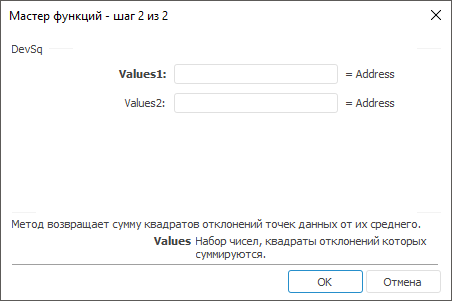

# DevSq: Регламентный отчёт, настольное приложение

DevSq: Регламентный отчёт, настольное приложение
-

# DevSq

[Мастер функций](../../UiReport_Organizational_master_function.htm)
 для функции DevSq выглядит следующим
 образом:

## Синтаксис

DevSq(Values,…)

## Параметры

Values1, Values2, …, ValuesN.
 Набор чисел, квадраты отклонений которых суммируются.

## Описание

Метод возвращает сумму квадратов отклонений точек данных от их среднего.

См. также:

[Мастер функций](../../UiReport_Organizational_master_function.htm)
 | [Статистические функции](UiReport_Func_Statistic.htm)

		Справочная
		 система на версию 10.9
		 от 18/08/2025,
		 © ООО «ФОРСАЙТ»,
