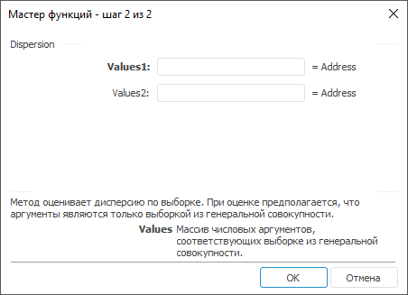

# Dispersion: Регламентный отчёт, настольное приложение

Dispersion: Регламентный отчёт, настольное приложение
-

# Dispersion

[Мастер функций](../../UiReport_Organizational_master_function.htm)
 для функции Dispersion выглядит
 следующим образом:

## Синтаксис

Dispersion(Values,…)

## Параметры

Values1, Values2, …, ValuesN.
 Массив числовых аргументов, соответствующих выборке из генеральной совокупности.

## Описание

Метод оценивает дисперсию по выборке.

## Комментарии

При оценке предполагается, что аргументы являются только выборкой из
 генеральной совокупности.

См. также:

[Мастер функций](../../UiReport_Organizational_master_function.htm)
 | [Статистические функции](UiReport_Func_Statistic.htm)

		Справочная
		 система на версию 10.9
		 от 18/08/2025,
		 © ООО «ФОРСАЙТ»,
