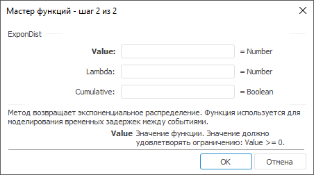

# ExponDist: Регламентный отчёт, настольное приложение

ExponDist: Регламентный отчёт, настольное приложение
-

# ExponDist

[Мастер функций](../../UiReport_Organizational_master_function.htm)
 для функции ExponDist выглядит
 следующим образом:

## Синтаксис

ExponDist(Value, Lambda, Cumulative)

## Параметры

Value. Значение функции. Значение
 должно удовлетворять ограничению: Value
 >= 0;

Lambda. Значение параметра.
 Значение должно удовлетворять ограничению: Lambda
 > 0;

Cumulative. Логическое значение,
 которое указывает, какую форму экспоненциальной функции использовать:

	- True. Функция ExponDist возвращает интегральную
	 функцию распределения;

	- False. Функция ExponDist возвращает функцию плотности
	 распределения.

## Описание

Метод возвращает экспоненциальное распределение.

## Комментарии

Функция используется для моделирования временных задержек между событиями.

См. также:

[Мастер функций](../../UiReport_Organizational_master_function.htm)
 | [Статистические функции](UiReport_Func_Statistic.htm)

		Справочная
		 система на версию 10.9
		 от 18/08/2025,
		 © ООО «ФОРСАЙТ»,
