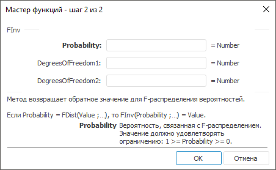

# FInv: Регламентный отчёт, настольное приложение

FInv: Регламентный отчёт, настольное приложение
-

# FInv

[Мастер функций](../../UiReport_Organizational_master_function.htm)
 для функции FInv выглядит следующим
 образом:

## Синтаксис

FInv(Probability, DegreesOfFreedom1, DegreesOfFreedom2)

## Параметры

Probability. Вероятность, связанная
 с F-распределением. Допустимые значения берутся из диапазона [0, 1];

DegreesOfFreedom1. Числитель
 степеней свободы. Допустимые значения берутся из диапазона [1, 10^10);

DegreesOfFreedom2. Знаменатель
 степеней свободы. Допустимые значения берутся из диапазона [1, 10^10).

## Описание

Метод возвращает обратное значение для F-распределения вероятностей.

## Комментарии

Если Probability = [FDist](UiReport_Func_Statistic_FDist.htm)(Value;…),
 то FInv(Probability;…)
 = Value.

См. также:

[Мастер функций](../../UiReport_Organizational_master_function.htm)
 | [Статистические функции](UiReport_Func_Statistic.htm)

		Справочная
		 система на версию 10.9
		 от 18/08/2025,
		 © ООО «ФОРСАЙТ»,
