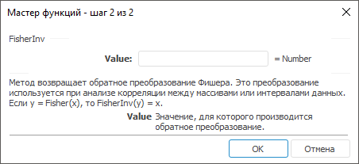

# FisherInv: Регламентный отчёт, настольное приложение

FisherInv: Регламентный отчёт, настольное приложение
-

# FisherInv

[Мастер функций](../../UiReport_Organizational_master_function.htm)
 для функции FisherInv выглядит
 следующим образом:

## Синтаксис

Fisher(Value)

## Параметры

Value. Значение, для которого
 производится обратное преобразование.

## Описание

Метод возвращает обратное преобразование Фишера.

## Комментарии

Преобразование используется при анализе корреляции между массивами или
 интервалами данных.

Если y = [Fisher](UiReport_Func_Statistic_Fisher.htm)(x), то FisherInv(y) = x.

См. также:

[Мастер функций](../../UiReport_Organizational_master_function.htm)
 | [Статистические функции](UiReport_Func_Statistic.htm)

		Справочная
		 система на версию 10.9
		 от 18/08/2025,
		 © ООО «ФОРСАЙТ»,
