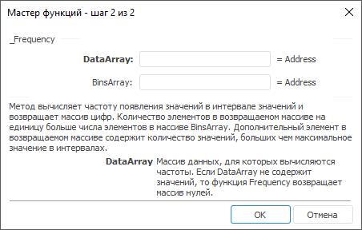

# _Frequency: Регламентный отчёт, настольное приложение

_Frequency: Регламентный отчёт, настольное приложение
-

# _Frequency

[Мастер функций](../../UiReport_Organizational_master_function.htm)
 для функции _Frequency выглядит
 следующим образом:

## Синтаксис

_Frequency(DataArray, BinsArray)

## Параметры

DataArray. Массив данных, для
 которых вычисляются частоты. Если DataArray
 не содержит значений, то функция Frequency
 возвращает массив нулей;

BinsArray. Массив интервалов,
 в которые группируются значения аргумента DataArray.
 Если BinsArray не содержит значений,
 то функция Frequency возвращает
 количество элементов в аргументе DataArray.

## Описание

Метод вычисляет частоту появления значений в интервале значений и возвращает
 массив цифр.

## Комментарии

Количество элементов в возвращаемом массиве на единицу больше числа
 элементов в массиве BinsArray.
 Дополнительный элемент в возвращаемом массиве содержит количество значений,
 больших чем максимальное значение в интервалах.

См. также:

[Мастер функций](../../UiReport_Organizational_master_function.htm)
 | [Статистические функции](UiReport_Func_Statistic.htm)

		Справочная
		 система на версию 10.9
		 от 18/08/2025,
		 © ООО «ФОРСАЙТ»,
