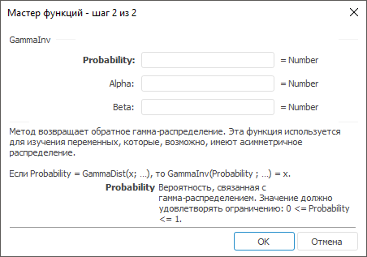

# GammaInv: Регламентный отчёт, настольное приложение

GammaInv: Регламентный отчёт, настольное приложение
-

# GammaInv

[Мастер функций](../../UiReport_Organizational_master_function.htm)
 для функции GammaInv выглядит
 следующим образом:

## Синтаксис

GammaInv(Probability, Alpha, Beta)

## Параметры

Probability. Вероятность, связанная
 с гамма-распределением. Значение должно удовлетворять ограничению: 0 <=
 Probability <= 1;

Alpha. Параметр распределения.
 Значение должно удовлетворять ограничению: Alpha
 >0;

Beta. Параметр распределения.
 Значение должно удовлетворять ограничению: Beta
 >0.

## Описание

Метод возвращает обратное гамма-распределение.

## Комментарии

Функция используется для изучения переменных, которые, возможно, имеют
 асимметричное распределение.

Если Probability = [GammaDist](UiReport_Func_Statistic_GammaDist.htm)(x …), то GammaInv(Probability; …) = x.

Если Beta = 1, то функция GammaInv возвращает стандартное
 гамма-распределение.

См. также:

[Мастер функций](../../UiReport_Organizational_master_function.htm)
 | [Статистические функции](UiReport_Func_Statistic.htm)

		Справочная
		 система на версию 10.9
		 от 18/08/2025,
		 © ООО «ФОРСАЙТ»,
