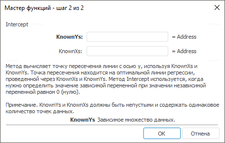

# Intercept: Регламентный отчёт, настольное приложение

Intercept: Регламентный отчёт, настольное приложение
-

# Intercept

[Мастер функций](../../UiReport_Organizational_master_function.htm)
 для функции Intercept выглядит
 следующим образом:

## Синтаксис

Intercept(KnownYs, KnownXs)

## Параметры

KnownYs. Зависимое множество
 данных;

KnownXs. Независимое множество
 данных.

## Описание

Метод вычисляет точку пересечения линии с осью y,
 используя KnownXs и KnownYs.

## Комментарии

Точка пересечения находится на оптимальной линии регрессии, проведенной
 через KnownXs и KnownYs.
 Функция Intercept используется,
 когда нужно определить значение зависимой переменной при значении независимой
 переменной равном 0 (нулю).

См. также:

[Мастер функций](../../UiReport_Organizational_master_function.htm)
 | [Статистические функции](UiReport_Func_Statistic.htm)

		Справочная
		 система на версию 10.9
		 от 18/08/2025,
		 © ООО «ФОРСАЙТ»,
