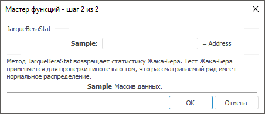

# JarqueBeraStat: Регламентный отчёт, настольное приложение

JarqueBeraStat: Регламентный отчёт, настольное приложение
-

# JarqueBeraStat

[Мастер функций](../../UiReport_Organizational_master_function.htm)
 для функции JarqueBeraStat выглядит
 следующим образом:

## Синтаксис

JarqueBeraStat(Sample)

## Параметры

Sample. Массив данных.

## Описание

Метод возвращает статистику Жака-Бера.

## Комментарии

Тест Жака-Бера применяется для проверки гипотезы о том, что рассматриваемый
 ряд имеет нормальное распределение.

См. также:

[Мастер функций](../../UiReport_Organizational_master_function.htm)
 | [Статистические функции](UiReport_Func_Statistic.htm)

		Справочная
		 система на версию 10.9
		 от 18/08/2025,
		 © ООО «ФОРСАЙТ»,
