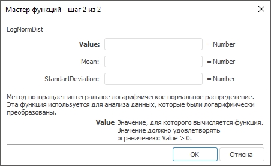

# LogNormDist: Регламентный отчёт, настольное приложение

LogNormDist: Регламентный отчёт, настольное приложение
-

# LogNormDist

[Мастер функций](../../UiReport_Organizational_master_function.htm)
 для функции LogNormDist выглядит
 следующим образом:

## Синтаксис

LogNormDist(Value, Mean, StandartDeviation)

## Параметры

Value. Значение, для которого
 вычисляется функция. Значение должно удовлетворять ограничению: Value > 0;

Mean. Среднее ln (Value);

StandartDeviation. Стандартное
 отклонение ln (Value).
 Значение должно удовлетворять ограничению: StandartDeviation
 > 0.

## Описание

Метод возвращает интегральное логарифмическое нормальное распределение.

## Комментарии

Функция используется для анализа данных, которые были логарифмически
 преобразованы.

См. также:

[Мастер функций](../../UiReport_Organizational_master_function.htm)
 | [Статистические функции](UiReport_Func_Statistic.htm)

		Справочная
		 система на версию 10.9
		 от 18/08/2025,
		 © ООО «ФОРСАЙТ»,
