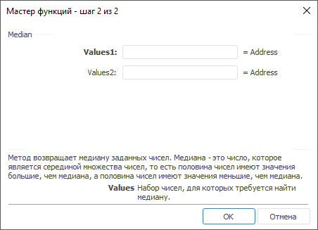

# Median: Регламентный отчёт, настольное приложение

Median: Регламентный отчёт, настольное приложение
-

# Median

[Мастер функций](../../UiReport_Organizational_master_function.htm)
 для функции Median выглядит следующим
 образом:

## Синтаксис

Median(Values,…)

## Параметры

Values1, Values2, …, ValuesN.
 Набор чисел, для которых требуется найти медиану.

## Описание

Метод возвращает медиану заданных чисел.

## Комментарии

Медиана - это число, которое является серединой множества чисел, то
 есть половина чисел имеют значения большие, чем медиана, а половина чисел
 имеют значения меньшие, чем медиана.

См. также:

[Мастер функций](../../UiReport_Organizational_master_function.htm)
 | [Статистические функции](UiReport_Func_Statistic.htm)

		Справочная
		 система на версию 10.9
		 от 18/08/2025,
		 © ООО «ФОРСАЙТ»,
