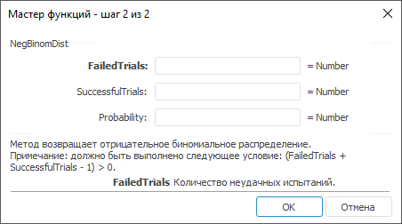

# NegBinomDist: Регламентный отчёт, настольное приложение

NegBinomDist: Регламентный отчёт, настольное приложение
-

# NegBinomDist

[Мастер функций](../../UiReport_Organizational_master_function.htm)
 для функции NegBinomDist выглядит
 следующим образом:

## Синтаксис

NegBinomDist(FailedTrials, SuccessfulTrials, Probability)

## Параметры

FailedTrials. Количество неудачных
 испытаний;

SuccessfulTrials. Пороговое
 значение числа успешных испытаний;

Probability. Вероятность успеха.
 Допустимые значения берутся из диапазона [0, 1].

Примечание.
 Необходимо выполнение условия (FailedTrials
 + SuccessfulTrials - 1) >
 0.

## Описание

Метод возвращает отрицательное биномиальное распределение.

## Комментарии

Функция возвращает вероятность того, что случится FailedTrials
 неудачных испытаний, прежде чем будет достигнуто SuccessfulTrials
 успешных испытаний, при том условии, что вероятность успешного испытания
 постоянна и равна значению аргумента Probability.
 Эта функция подобна биномиальному распределению, за тем исключением, что
 количество успехов фиксированное, а количество испытаний - переменное.
 Как и в случае биномиального распределения, испытания считаются независимыми.

См. также:

[Мастер функций](../../UiReport_Organizational_master_function.htm)
 | [Статистические функции](UiReport_Func_Statistic.htm)

		Справочная
		 система на версию 10.9
		 от 18/08/2025,
		 © ООО «ФОРСАЙТ»,
