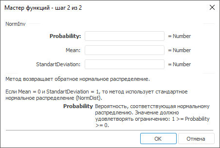

# NormInv: Регламентный отчёт, настольное приложение

NormInv: Регламентный отчёт, настольное приложение
-

# NormInv

[Мастер функций](../../UiReport_Organizational_master_function.htm)
 для функции NormInv выглядит следующим
 образом:

## Синтаксис

NormInv(Probability, Mean, StandartDeviation)

## Параметры

Probability. Вероятность, соответствующая
 нормальному распределению. Допустимые значения берутся из диапазона [0,
 1];

Mean. Среднее арифметическое
 распределения;

StandartDeviation. Стандартное
 отклонение распределения. Значение должно удовлетворять ограничению: StandartDeviation > 0.

## Описание

Метод возвращает обратное нормальное распределение.

## Комментарии

Если Mean = 0 и StandartDeviation
 = 1, то метод использует стандартное нормальное распределение ([NormDist](UiReport_Func_Statistic_NormsDist.htm)).

См. также:

[Мастер функций](../../UiReport_Organizational_master_function.htm)
 | [Статистические функции](UiReport_Func_Statistic.htm)

		Справочная
		 система на версию 10.9
		 от 18/08/2025,
		 © ООО «ФОРСАЙТ»,
