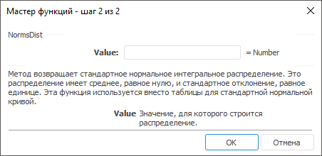

# NormsDist: Регламентный отчёт, настольное приложение

NormsDist: Регламентный отчёт, настольное приложение
-

# NormsDist

[Мастер функций](../../UiReport_Organizational_master_function.htm)
 для функции NormsDist выглядит
 следующим образом:

## Синтаксис

NormsDist(Value)

## Параметры

Value. Значение, для которого
 строится распределение.

## Описание

Метод возвращает стандартное нормальное интегральное распределение.

## Комментарии

Распределение имеет среднее, равное нулю, и стандартное отклонение,
 равное единице. Эта функция используется вместо таблицы для стандартной
 нормальной кривой.

См. также:

[Мастер функций](../../UiReport_Organizational_master_function.htm)
 | [Статистические функции](UiReport_Func_Statistic.htm)

		Справочная
		 система на версию 10.9
		 от 18/08/2025,
		 © ООО «ФОРСАЙТ»,
