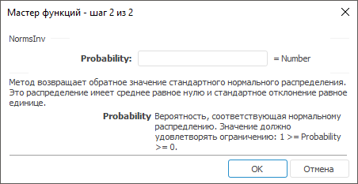

# NormsInv: Регламентный отчёт, настольное приложение

NormsInv: Регламентный отчёт, настольное приложение
-

# NormsInv

[Мастер функций](../../UiReport_Organizational_master_function.htm)
 для функции NormsInv выглядит
 следующим образом:

## Синтаксис

NormsInv(Probability)

## Параметры

Probability. Вероятность, соответствующая
 нормальному распределению. Допустимые значения берутся из диапазона [0,
 1].

## Описание

Метод возвращает обратное значение стандартного нормального распределения.

## Комментарии

Это распределение имеет среднее равное нулю и стандартное отклонение
 равное единице.

См. также:

[Мастер функций](../../UiReport_Organizational_master_function.htm)
 | [Статистические функции](UiReport_Func_Statistic.htm)

		Справочная
		 система на версию 10.9
		 от 18/08/2025,
		 © ООО «ФОРСАЙТ»,
