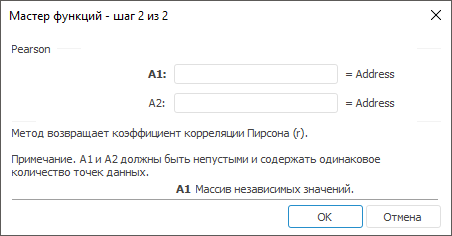

# Pearson: Регламентный отчёт, настольное приложение

Pearson: Регламентный отчёт, настольное приложение
-

# Pearson

[Мастер функций](../../UiReport_Organizational_master_function.htm)
 для функции Pearson выглядит следующим
 образом:

## Синтаксис

Pearson(A1, A2)

## Параметры

	- A1. Массив независимых
	 значений;

	- A2. Массив зависимых
	 значений.

Примечание.
 A1 и A2
 должны быть непусты и содержать одинаковое количество точек данных.

## Описание

Метод возвращает коэффициент корреляции Пирсона (r).

См. также:

[Мастер функций](../../UiReport_Organizational_master_function.htm)
 | [Статистические функции](UiReport_Func_Statistic.htm)

		Справочная
		 система на версию 10.9
		 от 18/08/2025,
		 © ООО «ФОРСАЙТ»,
