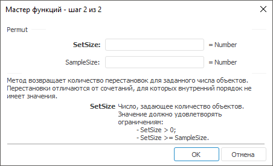

# Permut: Регламентный отчёт, настольное приложение

Permut: Регламентный отчёт, настольное приложение
-

# Permut

[Мастер функций](../../UiReport_Organizational_master_function.htm)
 для функции Permut выглядит следующим
 образом:

## Синтаксис

Permut(SetSize, SampleSize)

## Параметры

SetSize. Число, задающее количество
 объектов. Значение должно удовлетворять ограничениям:

	- SetSize > 0;

	- SetSize >= SampleSize;

SampleSize. Число, задающее
 количество объектов в каждой перестановке. Значение должно удовлетворять
 ограничению: SampleSize >=
 0.

## Описание

Метод возвращает количество перестановок для заданного числа объектов.

## Комментарии

Перестановка - это любое множество или подмножество объектов или событий,
 в котором внутренний порядок имеет значение. Перестановки отличаются от
 сочетаний, для которых внутренний порядок не имеет значения.

Функция используется, например, для вычисления вероятностей в лотереях.

См. также:

[Мастер функций](../../UiReport_Organizational_master_function.htm)
 | [Статистические функции](UiReport_Func_Statistic.htm)

		Справочная
		 система на версию 10.9
		 от 18/08/2025,
		 © ООО «ФОРСАЙТ»,
