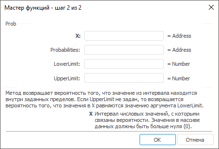

# Prob: Регламентный отчёт, настольное приложение

Prob: Регламентный отчёт, настольное приложение
-

# Prob

[Мастер функций](../../UiReport_Organizational_master_function.htm)
 для функции Prob выглядит следующим
 образом:

## Синтаксис

Prob(X, Probabilities, LowerLimit, UpperLimit)

## Параметры

X. Интервал числовых значений,
 с которыми связаны вероятности. Значения в массиве данных должны быть
 больше нуля;

Probabilities. Множество вероятностей,
 соответствующих значениям в аргументе X.
 Допустимые значения для множества берутся из диапазона [0, 1];

LowerLimit. Нижняя граница
 значения, для которого вычисляется вероятность;

UpperLimit. Необязательная
 верхняя граница значения, для которого требуется вычислить вероятность.

## Описание

Метод возвращает вероятность того, что значение из интервала находится
 внутри заданных пределов.

## Комментарии

Если UpperLimit не задан, то
 возвращается вероятность того, что значения в X
 равняются значению аргумента LowerLimit.

См. также:

[Мастер функций](../../UiReport_Organizational_master_function.htm)
 | [Статистические функции](UiReport_Func_Statistic.htm)

		Справочная
		 система на версию 10.9
		 от 18/08/2025,
		 © ООО «ФОРСАЙТ»,
