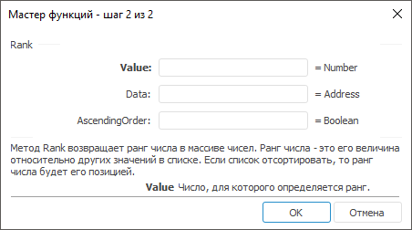

# Rank: Регламентный отчёт, настольное приложение

Rank: Регламентный отчёт, настольное приложение
-

# Rank

[Мастер функций](../../UiReport_Organizational_master_function.htm)
 для функции Rank выглядит следующим
 образом:

## Синтаксис

Rank(Value, Data, AscendingOrder)

## Параметры

Value. Число, для которого
 определяется ранг;

Data. Массив чисел;

AscendingOrder. Способ упорядочения:

	-

		- True.
		 Ранг числа определяется так, как если бы массив был отсортированным
		 в порядке убывания;

		- False.
		 Ранг числа определяется так, как если бы массив был отсортированным
		 в порядке возрастания.

## Описание

Метод возвращает ранг числа в массиве чисел.

## Комментарии

Ранг числа - это его величина относительно других значений в списке.
 Если список отсортировать, то ранг числа будет его позицией.

См. также:

[Мастер функций](../../UiReport_Organizational_master_function.htm)
 | [Статистические функции](UiReport_Func_Statistic.htm)

		Справочная
		 система на версию 10.9
		 от 18/08/2025,
		 © ООО «ФОРСАЙТ»,
