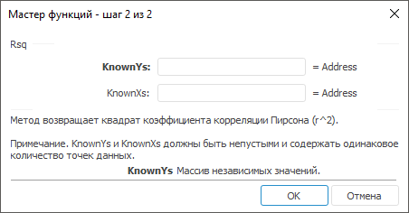

# Rsq: Регламентный отчёт, настольное приложение

Rsq: Регламентный отчёт, настольное приложение
-

# Rsq

[Мастер функций](../../UiReport_Organizational_master_function.htm)
 для функции Rsq выглядит следующим
 образом:

## Синтаксис

Rsq(KnownYs, KnownXs)

## Параметры

KnownYs. Массив независимых
 значений;

KnownXs. Массив зависимых значений.

Примечание.
 Параметры KnownYs и KnownXs
 должны быть непусты и содержать одинаковое количество точек данных.

## Описание

Метод возвращает квадрат коэффициента корреляции [Пирсона](UiReport_Func_Statistic_Pearson.htm)
 (r^2).

См. также:

[Мастер функций](../../UiReport_Organizational_master_function.htm)
 | [Статистические функции](UiReport_Func_Statistic.htm)

		Справочная
		 система на версию 10.9
		 от 18/08/2025,
		 © ООО «ФОРСАЙТ»,
