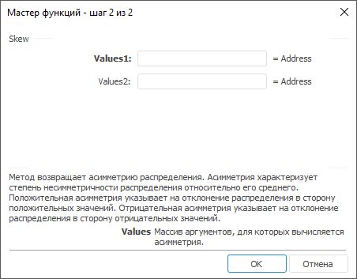

# Skew: Регламентный отчёт, настольное приложение

Skew: Регламентный отчёт, настольное приложение
-

# Skew

[Мастер функций](../../UiReport_Organizational_master_function.htm)
 для функции Skew выглядит следующим
 образом:

## Синтаксис

Skew(Values,…)

## Параметры

Values1, Values2, …, ValuesN.
 Массив аргументов, для которых вычисляется асимметрия.

## Описание

Метод возвращает асимметрию распределения.

## Комментарии

Асимметрия характеризует степень несимметричности распределения относительно
 его среднего. Положительная асимметрия указывает на отклонение распределения
 в сторону положительных значений. Отрицательная асимметрия указывает на
 отклонение распределения в сторону отрицательных значений.

См. также:

[Мастер функций](../../UiReport_Organizational_master_function.htm)
 | [Статистические функции](UiReport_Func_Statistic.htm)

		Справочная
		 система на версию 10.9
		 от 18/08/2025,
		 © ООО «ФОРСАЙТ»,
