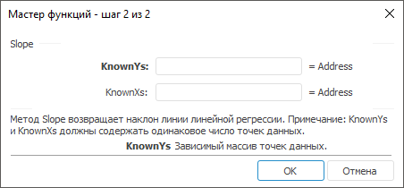

# Slope: Регламентный отчёт, настольное приложение

Slope: Регламентный отчёт, настольное приложение
-

# Slope

[Мастер функций](../../UiReport_Organizational_master_function.htm)
 для функции Slope выглядит следующим
 образом:

## Синтаксис

Slope(KnownYs, KnownXs)

## Параметры

KnownYs. Зависимый массив точек
 данных;

KnownXs. Независимый массив
 точек данных.

Примечание.
 Параметры KnownYs и KnownXs
 должны содержать одинаковое число точек данных.

## Описание

Метод возвращает наклон линии линейной регрессии.

## Комментарии

Наклон определяется как частное от деления расстояния по вертикали на
 расстояние по горизонтали между двумя любыми точками прямой, то есть наклон
 - это скорость изменения значений вдоль прямой.

См. также:

[Мастер функций](../../UiReport_Organizational_master_function.htm)
 | [Статистические функции](UiReport_Func_Statistic.htm)

		Справочная
		 система на версию 10.9
		 от 18/08/2025,
		 © ООО «ФОРСАЙТ»,
