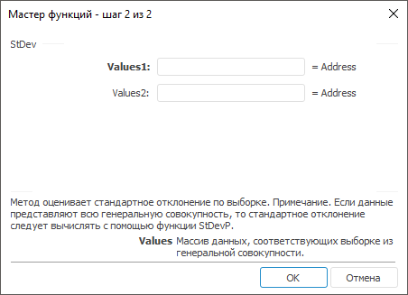

# StDev: Регламентный отчёт, настольное приложение

StDev: Регламентный отчёт, настольное приложение
-

# StDev

[Мастер функций](../../UiReport_Organizational_master_function.htm)
 для функции StDev выглядит следующим
 образом:

## Синтаксис

StDev(Values,…)

## Параметры

Values1, Values2, …, ValuesN.
 Массив данных, соответствующих выборке из генеральной совокупности.

## Описание

Метод оценивает стандартное отклонение по выборке.

## Комментарии

Стандартное отклонение - это мера того, насколько широко разбросаны
 точки данных относительно их среднего. Стандартное отклонение вычисляется
 с использованием «несмещенного» или «n-1»
 метода.

Если данные представляют всю генеральную совокупность, то стандартное
 отклонение вычисляйте с помощью функции [StDevP](UiReport_Func_Statistic_StDevP.htm).

См. также:

[Мастер функций](../../UiReport_Organizational_master_function.htm)
 | [Статистические функции](UiReport_Func_Statistic.htm)

		Справочная
		 система на версию 10.9
		 от 18/08/2025,
		 © ООО «ФОРСАЙТ»,
