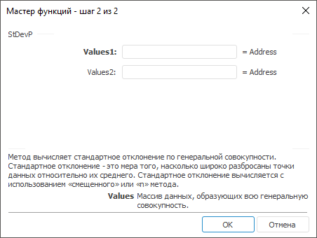

# StDevP: Регламентный отчёт, настольное приложение

StDevP: Регламентный отчёт, настольное приложение
-

# StDevP

[Мастер функций](../../UiReport_Organizational_master_function.htm)
 для функции StDevP выглядит следующим
 образом:

## Синтаксис

StDevP(Values,…)

## Параметры

Values1, Values2, …, ValuesN. Массив
 данных, образующих всю генеральную совокупность.

## Описание

Метод вычисляет стандартное отклонение по генеральной совокупности.

## Комментарии

Стандартное отклонение - это мера того, насколько широко разбросаны
 точки данных относительно их среднего. Стандартное отклонение вычисляется
 с использованием «смещенного» или «n»
 метода.

Если данные представляют выборку из генеральной совокупности, то стандартное
 отклонение вычисляйте с помощью функции [StDev](UiReport_Func_Statistic_StDev.htm).

См. также:

[Мастер функций](../../UiReport_Organizational_master_function.htm)
 | [Статистические функции](UiReport_Func_Statistic.htm)

		Справочная
		 система на версию 10.9
		 от 18/08/2025,
		 © ООО «ФОРСАЙТ»,
