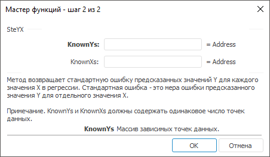

# SteYX: Регламентный отчёт, настольное приложение

SteYX: Регламентный отчёт, настольное приложение
-

# SteYX

[Мастер функций](../../UiReport_Organizational_master_function.htm)
 для функции SteYX выглядит следующим
 образом:

## Синтаксис

SteYX(KnownYs, KnownXs)

## Параметры

KnownYs. Массив зависимых точек
 данных;

KnownXs. Массив независимых
 точек данных;

Примечание.
 Параметры KnownYs и KnownXs
 должны содержать одинаковое число точек данных.

## Описание

Метод возвращает стандартную ошибку предсказанных значений Y
 для каждого значения X в регрессии.

## Комментарии

Стандартная ошибка - это мера ошибки предсказанного значения Y
 для отдельного значения X.

См. также:

[Мастер функций](../../UiReport_Organizational_master_function.htm)
 | [Статистические функции](UiReport_Func_Statistic.htm)

		Справочная
		 система на версию 10.9
		 от 18/08/2025,
		 © ООО «ФОРСАЙТ»,
