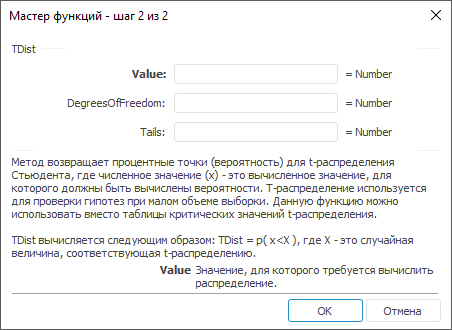

# TDist: Регламентный отчёт, настольное приложение

TDist: Регламентный отчёт, настольное приложение
-

# TDist

[Мастер функций](../../UiReport_Organizational_master_function.htm)
 для функции TDist выглядит следующим
 образом:

## Синтаксис

TDist(Value, DegreesOfFreedom, Tails)

## Параметры

Value. Значение, для которого
 требуется вычислить распределение;

DegreesOfFreedom. Целое, указывающее
 число степеней свободы. Значение должно удовлетворять ограничению: DegreesOfFreedom >= 1;

Tails. Число возвращаемых хвостов
 распределения. Допустимые значения:

	- 1. Функция TDist
	 возвращает одностороннее распределение;

	- 2. Функция TDist
	 возвращает двухстороннее распределение.

## Описание

Метод возвращает процентные точки (вероятность) для t-распределения
 Стьюдента, где численное значение (x)
 - это вычисленное значение, для которого должны быть вычислены вероятности.

## Комментарии

T-распределение используется для проверки гипотез при малом объеме выборки.
 Данную функцию можно использовать вместо таблицы критических значений
 t-распределения.

Функция вычисляется по формуле:

TDist = p(x<X),

где:

	- X. Случайная величина,
	 соответствующая t-распределению.

См. также:

[Мастер функций](../../UiReport_Organizational_master_function.htm)
 | [Статистические функции](UiReport_Func_Statistic.htm)

		Справочная
		 система на версию 10.9
		 от 18/08/2025,
		 © ООО «ФОРСАЙТ»,
