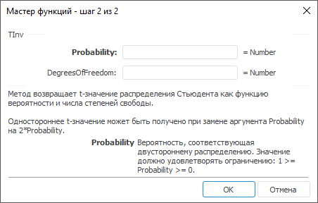

# TInv: Регламентный отчёт, настольное приложение

TInv: Регламентный отчёт, настольное приложение
-

# TInv

[Мастер функций](../../UiReport_Organizational_master_function.htm)
 для функции TInv выглядит следующим
 образом:

## Синтаксис

TInv(Probability, DegreesOfFreedom)

## Параметры

Probability. Вероятность, соответствующая
 двустороннему распределению. Допустимые значения для множества берутся
 из диапазона [0, 1];

DegreesOfFreedom. Число степеней
 свободы, характеризующее распределение. Значение должно удовлетворять
 ограничению: DegreesOfFreedom
 >= 1.

## Описание

Метод возвращает t-значение распределения Стьюдента как функцию вероятности
 и числа степеней свободы.

## Комментарии

Одностороннее t-значение может быть получено при замене аргумента Probability на 2*Probability.

См. также:

[Мастер функций](../../UiReport_Organizational_master_function.htm)
 | [Статистические функции](UiReport_Func_Statistic.htm)

		Справочная
		 система на версию 10.9
		 от 18/08/2025,
		 © ООО «ФОРСАЙТ»,
