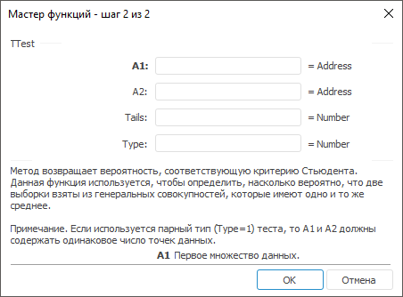

# TTest: Регламентный отчёт, настольное приложение

TTest: Регламентный отчёт, настольное приложение
-

# TTest

[Мастер функций](../../UiReport_Organizational_master_function.htm)
 для функции TTest выглядит следующим
 образом:

## Синтаксис

TTest(A1, A2, Tails, Type)

## Параметры

A1. Первое множество данных;

A2. Второе множество данных;

Tails. Число хвостов распределения.
 Допустимые значения:

	- 1. Функция TTest
	 использует одностороннее распределение;

	- 2. Функция TTest
	 использует двухстороннее распределение;

Type. Вид исполняемого t-теста:

	- 1. Парный. В этом случае
	 A1 и A2
	 должны содержать одинаковое число точек данных;

	- 2. Двухвыборочный с
	 равными дисперсиями (гомоскедастический);

	- 3. Двухвыборочный с
	 неравными дисперсиями (гетероскедастический).

## Описание

Метод возвращает вероятность, соответствующую критерию Стьюдента.

## Комментарии

Функция используется, чтобы определить, насколько вероятно, что две
 выборки взяты из генеральных совокупностей, которые имеют одно и то же
 среднее.

См. также:

[Мастер функций](../../UiReport_Organizational_master_function.htm)
 | [Статистические функции](UiReport_Func_Statistic.htm)

		Справочная
		 система на версию 10.9
		 от 18/08/2025,
		 © ООО «ФОРСАЙТ»,
