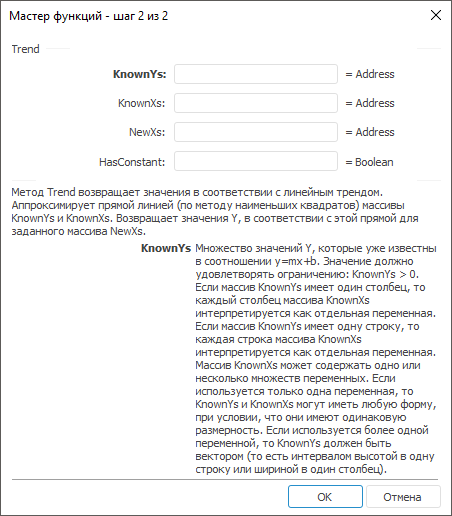

# Trend: Регламентный отчёт, настольное приложение

Trend: Регламентный отчёт, настольное приложение
-

# Trend

[Мастер функций](../../UiReport_Organizational_master_function.htm)
 для функции Trend выглядит следующим
 образом:

## Синтаксис

Trend(KnownYs, KnownXs, NewXs, HasConstant)

## Параметры

KnownYs. Множество значений
 Y, которые уже известны в соотношении
 y = m*x+b. Значения в массиве данных должны быть больше нуля;

KnownXs. Множество значений
 X, которые уже известны для соотношения
 y = m*x+b;

NewXs. Новые значения X, для которых Trend
 возвращает соответствующие значения Y.
 NewXs должен содержать столбец
 (или строку) для каждой независимой переменной, как и KnownXs;

HasConstant. Логическое значение,
 которое указывает, требуется ли, чтобы константа b
 была равна нулю:

	- True. Константа b вычисляется обычным образом;

	- False. Константа b полагается равной «0», а значения
	 m подбираются так, чтобы
	 y = m*x.

## Описание

Метод возвращает значения в соответствии с линейным трендом.

## Комментарии

Метод аппроксимирует прямой линией (по методу наименьших квадратов)
 массивы KnownYs и KnownXs.
 Возвращает значения Y, в соответствии
 с этой прямой для заданного массива NewXs.

Если массив KnownYs имеет один
 столбец, то каждый столбец массива KnownXs
 интерпретируется как отдельная переменная. Если массив KnownYs
 имеет одну строку, то каждая строка массива KnownXs
 интерпретируется как отдельная переменная. Массив KnownXs
 может содержать одно или несколько множеств переменных. Если используется
 только одна переменная, то KnownYs
 и KnownXs могут иметь любую форму,
 при условии, что они имеют одинаковую размерность. Если используется более
 одной переменной, то KnownYs
 должен быть вектором (то есть интервалом высотой в одну строку или шириной
 в один столбец). Таким образом, если KnownYs
 - это один столбец, то KnownXs
 и NewXs должны иметь такое же
 количество столбцов. Если KnownYs
 - это одна строка, то KnownXs
 и NewXs должны иметь такое же
 количество строк.

См. также:

[Мастер функций](../../UiReport_Organizational_master_function.htm)
 | [Статистические функции](UiReport_Func_Statistic.htm)

		Справочная
		 система на версию 10.9
		 от 18/08/2025,
		 © ООО «ФОРСАЙТ»,
