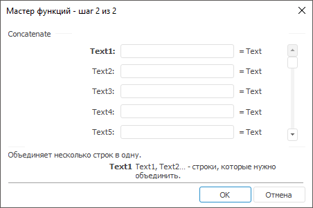

# Concatenate: Регламентный отчёт, настольное приложение

Concatenate: Регламентный отчёт, настольное приложение
-

# Concatenate

[Мастер функций](../../UiReport_Organizational_master_function.htm)
 для функции Concatenate выглядит
 следующим образом:

## Синтаксис

Concatenate(Text1, Text2[, Text3[, Text4[, Text5[,
 Text6[, Text7[, Text8[, Text9[, Text10])

## Параметры

Text1, Text2 … Text10. Строки
 для объединения.

Примечание.
 В качестве параметра можно указывать как непосредственно значение параметра,
 так и адрес ячейки, в которой оно располагается.

## Описание

Возвращает результат объединения двух или более текстовых строк в одну.

## Комментарии

Объединены могут быть не более десяти строк.

## Пример

		 Формула
		 Результат
		 Описание

		 Concatenate("abc","def")
		 abcdef
		 Объединение строк abc и def в одну.

		 Concatenate("аб",B6,"де")
		 абвгде
		 Объединение строк «аб», «де» и строки в ячейке B6 в одну. Ячейка
		 B6 содержит значение «вг».

См. также:

[Мастер функций](../../UiReport_Organizational_master_function.htm)
 │ [Текстовые
 функции](UiReport_Func_Text.htm)

		Справочная
		 система на версию 10.9
		 от 18/08/2025,
		 © ООО «ФОРСАЙТ»,
